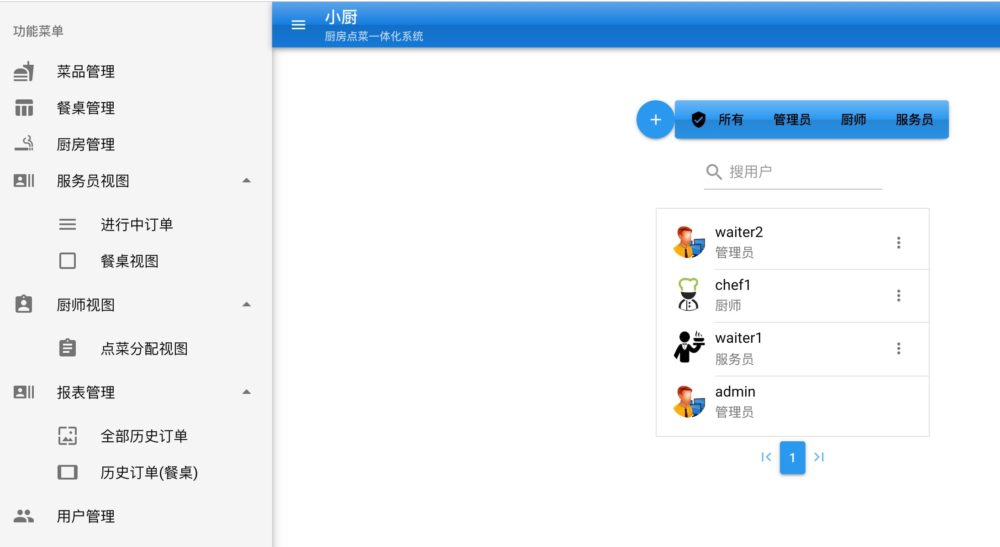
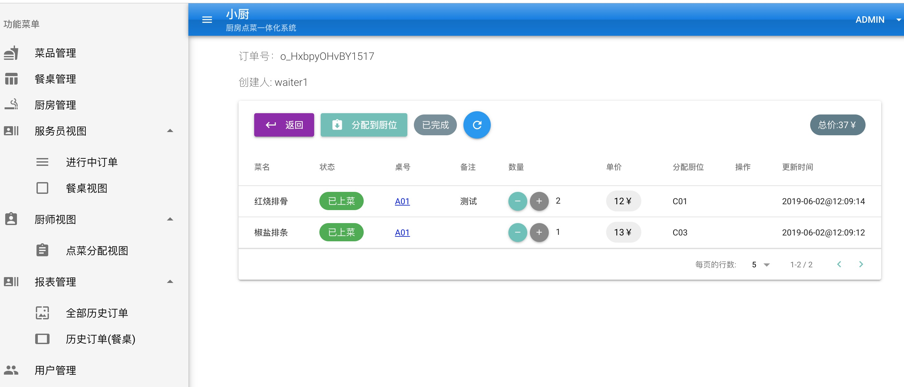

# chef-assist

## 功能说明
* 三种用户角色：餐厅服务员，后厨人员，管理员
* 服务员负责点菜录入，订单的建立和完成，菜品状态跟踪
* 后厨人员只负责看板做菜，做完菜更新菜品状态
* 管理员可以做菜品，厨位，餐桌，人员，订单等相关的一切操作

## 硬件要求
有浏览器能上网的任何终端皆可，手机，平板，电脑都行

## 适用场景
餐馆，酒店

## 技术
### 后台
java, springboot, mybatis, liquibase，mysql...
### 前端
VueJs框架之quasar

### 视频demo
 [视频演示](https://v.youku.com/v_show/id_XNDIxMTQ3NTAwMA==.html?spm=a2h3j.8428770.3416059.1 "视频演示")

## 厨房视图
点菜传菜一体系统


## 餐桌视图


## 菜品管理


## 用户管理


## 订单详情


## 历史订单


## 程序运行指南
### 后台
#### 数据库
首先新建数据库chef_assist:
```
create database if not exists chef_assist  default charset utf8 collate utf8_general_ci;
```
#### 启动Springboot程序：
使用intellij打开pom.xml, open as project

修改数据库用户名和密码,在application-*.properties中的如下两行:

```
spring.datasource.username=root
spring.datasource.password=Passw0rd
```

在ChefAssistApplication类上右键Debug或者Run启动程序

程序使用了liquibase会自动在刚才创建的数据库中初始化表结构和一些必要数据，例如admin用户

admin用户的默认密码也为admin，默认服务端口号为8686，如果需要可手动更改（但需要考虑前端做相应的适配）

#### 启动前端程序
前端用的是基于vuejs的quasar框架，在启动前需要安装nodejs(包括npm包管理器)，和quasar-cli(参考：http://www.quasarchs.com/quasar-cli/installation)

在安装好上述依赖后，进入chefassist-web目录，先执行npm install,成功后再执行:

```
quasar dev
```

一切顺利后，则可在浏览器中浏览http://localhost:8685/， 即默认前端端口号为8685

### 跨域问题
后台是做了跨域限制访问的，只允许localhost:8685的请求，具体配置在application-*.properties中的
```
origin.base=http://localhost:8685
```
